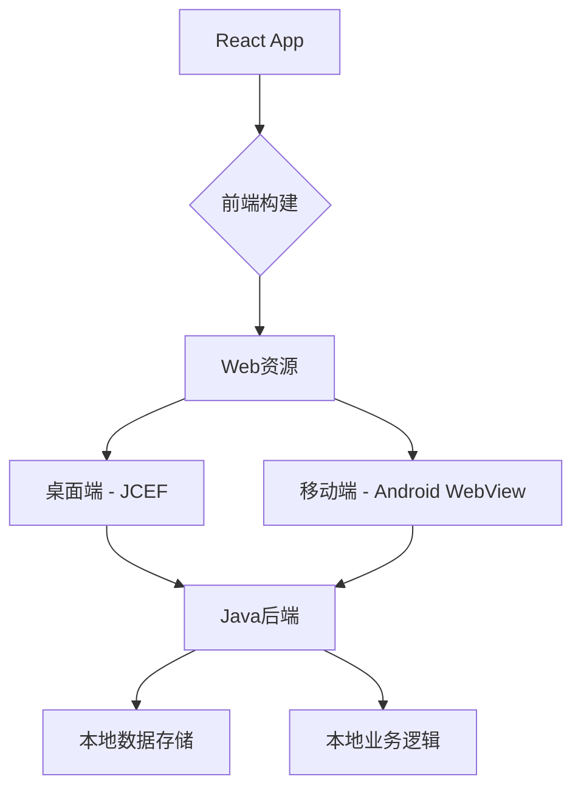
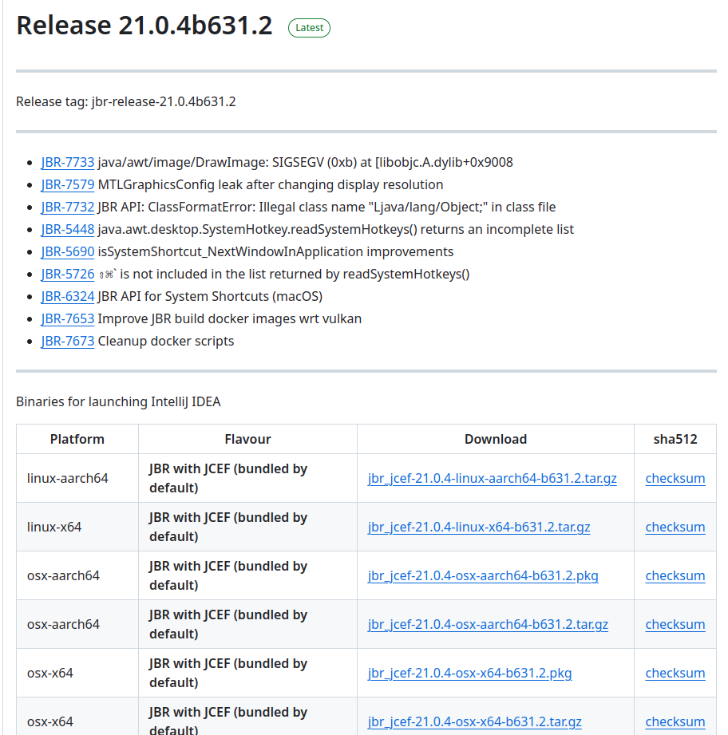

# 架构概述


1. 前端开发:
   - 使用React开发前端应用。
   - 构建时生成静态HTML、CSS和JavaScript文件。

2. 桌面端 (JCEF):
   - 使用Java创建一个桌面应用程序框架。
   - 集成JCEF来加载和显示React应用。
   - 实现Java和JavaScript之间的通信接口。

3. 移动端 (Android WebView):
   - 创建Android应用，使用WebView加载React应用。
   - 实现Android原生代码和JavaScript之间的通信接口。

4. 后端开发:
   - 使用Java实现后端逻辑。
   - 设计一个统一的API接口，供桌面端和移动端使用。
   - 实现本地数据存储和业务逻辑处理。

5. 构建和打包:
   - 为桌面端创建可执行文件，包含Java后端、JCEF和React应用。
   - 为Android创建APK，包含Java后端、WebView和React应用。


# 环境配置
## JDK 必须使用指定版本jcef-21.0.4
从 [JCEF发布页下载相应平台（开发者正在使用的平台）的二进制包](https://github.com/JetBrains/JetBrainsRuntime/releases)

例如本人下载的就是[jbr_jcef-21.0.4-linux-x64-b631.2.tar.gz](https://cache-redirector.jetbrains.com/intellij-jbr/jbr_jcef-21.0.4-linux-x64-b631.2.tar.gz)
然后在IDEA里配置JDK ，选择从本地加载，选择刚下载好的jdk包安装
## 前端react
前端相关的配置似乎可以在`pom.xml`里用maven自动化配置，但我没搞，以下是手动安装相关环境的介绍：

1. 首先确保你的电脑安装了 Node.js 环境：
```bash
# 检查是否安装了 Node.js
node -v
# 检查是否安装了 npm
npm -v
```

如果没有安装，需要先去 Node.js 官网 (https://nodejs.org) 下载安装最新的 LTS 版本。

2. 然后进入前端文件夹并安装依赖（务必确保处于正确路径：
```bash
# 进入项目目录
cd frontend/

# 安装项目依赖
npm install
```

3. 启动开发服务器：
```bash
npm run dev
```

这样项目就会在本地启动，通常是在 `http://localhost:3000`，如果端口被占用（通常是你多次启动这个开发服务器，却没把之前启动的关掉），新版`npm`一般会自动帮你切换到其他端口，请关注终端的相关输出


# 调试相关
## 总体说明
`npm run dev`可以在`localhost:3000`这个地址启动一个用于调试的服务器（假如这个端口未被占用的话），此时如果你用浏览器访问这个地址也是可以看到前端界面的，但我们需要让前端和后端交互，所以只运行前端是不行的。
后端的JCEF (Java Chromium Embedded Framework) 用于提供前后端互操作的桥接（Bridge），所以想要调试整个项目，必然也要启动后端。如果不启动后端而只启动前端，然后通过浏览器访问的话，你会发现一些向需要后端查询数据的ui部分会报错飘红。
## 调试步骤
确保位于`frontend/`路径下，然后再运行`npm run dev`。
之后如果你环境配置好了的话，就可以直接运行`ReactAppLoader`中的`main`。
需要注意的是，虽然此时你仍然能用浏览器访问`localhost:3000`，但也会有类似没有启动后端的报错，因为后端相关的内容传到前端都依靠JCEF的桥接（详见`JcefTodoBridge`）。
你可以在运行`ReactAppLoader`后弹出的窗口中看到正常运行的前端，在这里面的前端可以和后端交互。

# 构建相关
待完成