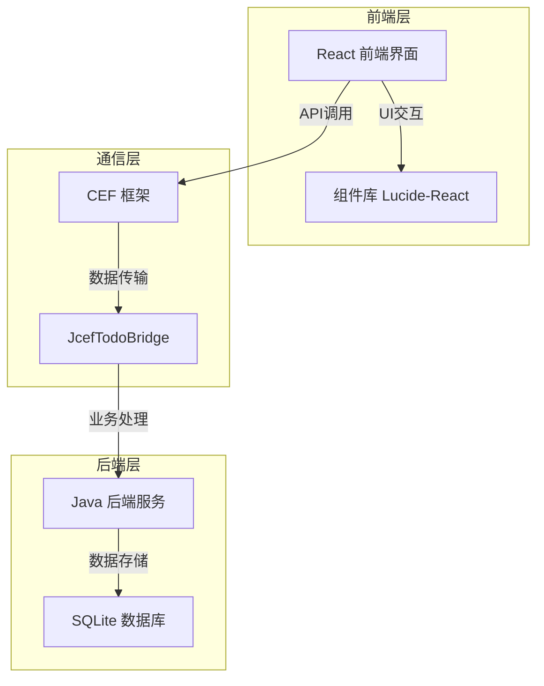
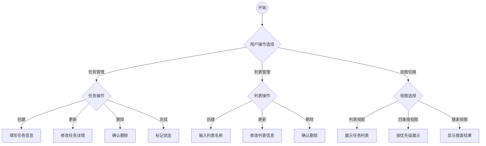
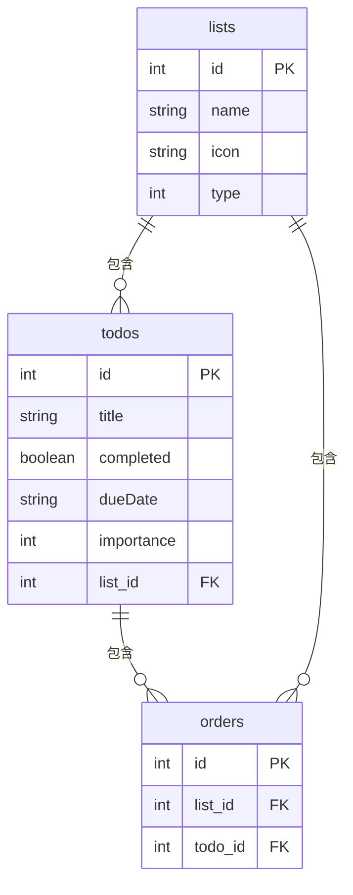

## 1. 引言
1. **引言**

本需求分析文档旨在详细描述一个创新的待办事项管理系统，该系统基于Java后端技术和React前端框架构建。该系统设计的核心理念是帮助用户更有效地管理和组织他们的日常任务，通过一系列智能和直观的功能，提升用户的工作效率和生活质量。

---

2. **系统背景与目标**

#### 背景
在当下快节奏的现代生活中，有效的时间管理和任务组织已成为众多人士面临的难题。

尽管市面上不乏任务规划类工具，但这些工具大多仅具备任务记录、回顾分析及文字视图等基础功能，难以满足更深层次的需求。

#### 需求分析

研究指出，对于数量超过10个的任务集，未经过训练的普通人很难短时间分析比较，得到比较合理的规划。这主要源于对任务重要性的衡量不理性和时间分配的局域性，最终会直接影响任务的完成质量。

针对大学生学习和生活的复杂场景，我们发现任务数量往往超过20个。而面对如此繁多的任务，和频繁的任务更新。

因此，我们急需一款能够**自动进行任务规划**的应用来代替繁琐的人工规划过程。这款应用需要能够智能地分析任务的重要性、紧急程度以及相互之间的关联性，从而为用户提供一个科学、合理的任务规划方案。同时，它还需要具备强大的任务管理能力，包括任务的创建、编辑、跟踪、提醒以及完成状态的更新等，以应对频繁的任务变动。

为了应对这一需求，我们开发了一个全面的待办事项管理系统。该系统的主要目标是提供一个用户友好的平台，使用户能够轻松创建、编辑、跟踪和完成他们的任务。通过**可视化**的任务排序和分布，任务优先级划分功能，用户可以更直观地理解和管理自己的任务列表，从而提高工作效率。

---


最终我们实现了一个本地化的应用，同时留有webDAV接口来提供多设备互联的可能。整体上我们实现了Windows和Linux端，但是在Android端遇见了问题。

#### 3. 概要分析

在深入洞察并理解用户需求的前提下，我们团队专注于打造一款专为高效管理复杂任务设计的本地应用。此外，我们还精心规划了webDAV接口，以期为用户提供跨设备无缝连接与数据同步的卓越体验。

**本地化应用实现深度解析**：

在着手开发这款任务管理应用之初，我们首要考虑的是其本地化功能的重要性。鉴于维护一个远程IP和服务器所需的巨额成本不是我们能够负担的，我们深知若仅仅将应用定位于比赛展示，将极大地限制了其实际价值和长远影响力。我们的愿景是让这款应用真正融入并服务于广大用户，特别是帮助同学们在日常学习生活中高效管理任务，提升效率。

因此，我们毅然决然地选择了在本地建立数据库，并围绕这一核心构建了应用的相关功能。这一决策不仅使得应用有了被使用和维护的可能，还确保了应用的稳定性和数据的安全性。通过我们团队的精心设计和不懈努力，我们成功地在Windows和Linux这两个主流平台上推出了应用版本。这些版本不仅具备全面的任务管理功能，还融入了用户友好的界面设计和流畅的交互体验，让用户能够轻松上手并高效地使用应用。

总的来说，我们本地化应用的实现不仅体现了我们对用户需求的深刻理解，更彰显了我们对产品实用性和长远价值的坚定追求。

**webDAV接口设计**：

在深入探索用户需求并成功实现本地化应用的基础上，我们深刻意识到，仅仅提供一个本地化的任务管理解决方案是远远不够的。随着现代生活的快节奏和多样化，用户往往需要在多个设备之间频繁切换，以应对不同的学习和工作场景。因此，为了进一步提升用户体验，我们特别设计了webDAV接口。

webDAV接口如同一座桥梁，连接着用户手中的不同设备，实现了数据的无缝同步与切换。通过这一接口，用户能够轻松地将任务数据在不同设备间进行同步，确保数据的实时更新与共享。这意味着，无论用户身处何地，是在家中电脑旁，还是在外出时的手机或平板上，都能随时随地访问和更新自己的任务列表，从而保持工作和学习的高效性与连续性。尤为值得一提的是，当前网络上已有众多公司提供免费的WebDAV服务，在数据量不大的情况下，用户完全可以享受免费且便捷的服务，使得应用在免费性与便捷性之间找到了完美的平衡点。

**Android端开发挑战与反思**：

在成功推出Windows和Linux版本的任务管理应用后，我们满怀信心地踏上了Android端开发的征程。我们深知，Android平台拥有庞大的用户群体，且用户对任务管理应用的需求同样迫切。因此，我们投入了大量的时间和资源，力求在Android平台上打造一个同样出色、甚至更加优化的应用版本。

在开发过程中，我们遇到了诸多技术难题。Android平台的碎片化问题让我们在适配不同设备和系统版本时费尽心思。同时，Android平台的内存管理和性能优化也是一项艰巨的挑战，需要我们不断调试和优化代码，以确保应用的流畅运行。

由于时间的限制和开发经验的限制，尽管我们付出了巨大的努力，并取得了一定的进展，比如成功实现了部分核心功能，优化了界面设计等，但最终我们还是在Android端开发上遭遇了失败。我们发现，由于Android平台的复杂性和多样性，我们的应用在部分设备上出现了兼容性问题，导致用户无法正常使用。

---

4. **功能需求**

为了满足用户多样化的任务管理需求，我们的待办事项管理系统将提供以下主要功能：

- **任务创建与编辑**：用户可以轻松创建新任务，并随时对已有任务进行编辑，包括修改任务名称、描述、截止日期等。
- **任务排序与优先级划分**：系统支持用户根据任务的紧急程度和重要性对任务进行排序和优先级划分，以便用户能够优先处理最重要的任务。
- **任务跟踪与完成**：用户可以实时跟踪任务的进度，并在任务完成后进行标记。系统还会记录任务的完成情况，为用户提供历史数据参考。
- **可视化界面**：系统提供直观的可视化界面，使用户能够一目了然地查看自己的任务列表和优先级分布。
- **用户管理**：系统支持个性化设置，确保用户数据的安全性和隐私性。


## 2. 系统概述

### 2.1 系统架构

该系统采用分层架构，主要包括前端层、通信层和后端层。前端使用 React 构建用户界面，后端由 Java 服务和 SQLite 数据库组成，通过 CEF 框架进行通信。

#### 系统架构图



### 2.2 主要功能流程

系统的主要功能包括任务管理、列表管理、视图切换等。以下流程图展示了用户操作的主要路径。

#### 主要功能流程图



### 2.3 数据模型关系

系统的数据模型包括 `todos`、`lists` 和 `orders` 三个主要表，彼此之间通过外键关联。

#### 数据模型关系图



## 3. 功能需求

### 3.1 任务管理模块

#### 3.1.1 创建任务

- **入口：** TodoView 组件中的新建任务表单。
- **流程：**
  1. 用户在表单中输入任务标题、截止日期和重要性。
  2. 点击“新建任务”按钮提交表单。
  3. 前端调用 `jcefBridge.addTodo()` 方法，将任务数据发送到后端。
  4. 后端将任务数据插入到数据库的 `todos` 表中，并生成新的任务 ID。
  5. 后端返回包含新任务 ID 的 JSON 数据给前端。
  6. 前端更新任务列表，显示新创建的任务。
- **输入：**
  - 任务标题 (字符串, 必填)
  - 截止日期 (字符串, 可选)
  - 重要性 (整数, 0-100, 可选，默认为50)
  - 所属列表 (字符串, 根据当前选择的列表)
- **输出：** 包含新任务完整信息的 JSON 对象。
- **异常处理：**
  - 标题为空：提示用户输入标题。
  - 其他异常：显示错误信息，例如数据库插入失败等。

#### 3.1.2 更新任务

- **入口：** TodoView 组件中的任务项。
- **流程：**
  1. 用户点击任务项，进入任务编辑页面。
  2. 用户修改任务标题、截止日期、重要性和所属列表。
  3. 点击“保存”按钮提交修改。
  4. 前端调用 `jcefBridge.updateTodo()` 方法，将修改后的任务数据发送到后端。
  5. 后端更新数据库中对应任务的数据。
  6. 后端返回更新后的任务数据给前端。
  7. 前端更新任务列表，显示修改后的任务信息。
- **输入：**
  - 任务 ID (整数, 必填)
  - 任务标题 (字符串, 可选)
  - 截止日期 (字符串, 可选)
  - 重要性 (整数, 0-100, 可选)
  - 所属列表 (字符串, 可选)
- **输出：** 更新后的任务的 JSON 对象。
- **异常处理：**
  - 任务 ID 无效：提示用户任务不存在。
  - 其他异常：显示错误信息，例如数据库更新失败等。

#### 3.1.3 删除任务

- **入口：** TodoView 组件中的任务项。
- **流程：**
  1. 用户点击任务项的删除按钮。
  2. 前端调用 `jcefBridge.deleteTodo()` 方法，将任务 ID 发送到后端。
  3. 后端从数据库中删除对应任务的数据。
  4. 后端返回成功或失败信息给前端。
  5. 前端更新任务列表，移除已删除的任务。
- **输入：** 任务 ID (整数, 必填)
- **输出：** 成功或失败信息。
- **异常处理：**
  - 任务 ID 无效：提示用户任务不存在。
  - 其他异常：显示错误信息，例如数据库删除失败等。

#### 3.1.4 完成任务

- **入口：** TodoView 组件中的任务项的复选框。
- **流程：**
  1. 用户点击任务项的复选框，切换任务的完成状态。
  2. 前端调用 `jcefBridge.updateTodo()` 方法，将更新后的任务数据（`completed` 字段）发送到后端。
  3. 后端更新数据库中对应任务的完成状态。
  4. 后端返回更新后的任务数据给前端。
  5. 前端更新任务列表，更新任务的完成状态显示。如果当前列表不是“历史”列表，则移除已完成的任务。
- **输入：** 任务 ID (整数, 必填)
- **输出：** 更新后的任务的 JSON 对象。
- **异常处理：** 同更新任务。

#### 3.1.5 搜索任务

- **入口：** SearchBox 组件。
- **流程：**
  1. 用户在搜索框中输入关键字。
  2. 前端调用 `jcefBridge.searchTodos()` 方法，将关键字发送到后端。
  3. 后端根据关键字查询数据库，返回匹配的任务列表。
  4. 前端显示搜索结果。
- **输入：** 搜索关键字 (字符串)
- **输出：** 匹配的任务列表 JSON 数组。
- **异常处理：** 数据库查询失败等。

### 3.2 列表管理模块

#### 3.2.1 创建列表

- **入口：** TodoApp 组件中的“新建列表”按钮。
- **流程：**
  1. 用户点击“新建列表”按钮，弹出创建列表的输入框。
  2. 用户输入列表名称。
  3. 点击“确认”按钮提交。
  4. 前端调用 `jcefBridge.addList()` 方法，将列表名称发送到后端。
  5. 后端将新列表插入到 `lists` 表中，并生成新的列表 ID。
  6. 后端返回包含新列表 ID 的 JSON 数据给前端。
  7. 前端更新列表，显示新创建的列表。
- **输入：**
  - 列表名称 (字符串, 必填)
  - 列表图标 (字符串, 可选, 默认为 '•')
  - 列表类型 (数字, 可选，默认为 0)
- **输出：** 包含新列表完整信息的 JSON 对象。
- **异常处理：**
  - 列表名称为空：提示用户输入列表名称。
  - 列表名称已存在：提示用户列表已存在。
  - 其他异常：显示错误信息，例如数据库插入失败等。

#### 3.2.2 更新列表

- **入口：** TodoApp 组件中的列表项的编辑按钮。
- **流程：**
  1. 用户点击列表项的编辑按钮，列表名称变为可编辑状态。
  2. 用户修改列表名称。
  3. 点击确认按钮或按下回车键提交修改。
  4. 前端调用 `jcefBridge.updateList()` 方法，将修改后的列表数据发送到后端。
  5. 后端更新数据库中对应列表的数据。
  6. 后端返回更新后的列表数据给前端。
  7. 前端更新列表，显示修改后的列表名称。
- **输入：**
  - 列表 ID (整数, 必填)
  - 列表名称 (字符串, 必填)
  - 列表图标 (字符串, 可选)
  - 列表类型 (数字, 可选)
- **输出：** 更新后的列表的 JSON 对象。
- **异常处理：**
  - 列表 ID 无效：提示用户列表不存在。
  - 列表名称为空：提示用户输入列表名称。
  - 列表名称已存在：提示用户列表已存在。
  - 其他异常：显示错误信息，例如数据库更新失败等。

#### 3.2.3 删除列表

- **入口：** TodoApp 组件中的列表项的删除按钮。
- **流程：**
  1. 用户点击列表项的删除按钮。
  2. 前端调用 `jcefBridge.deleteList()` 方法，将列表 ID 发送到后端。
  3. 后端从数据库中删除对应列表的数据，并删除该列表下所有关联的任务。
  4. 后端返回成功或失败信息给前端。
  5. 前端更新列表，移除已删除的列表。如果当前列表是正在被删除的列表，则切换到默认列表“我的一天”。
- **输入：** 列表 ID (整数, 必填)
- **输出：** 成功或失败信息。
- **异常处理：**
  - 列表 ID 无效：提示用户列表不存在。
  - 默认列表无法删除：提示用户默认列表无法删除。
  - 其他异常：显示错误信息，例如数据库删除失败等。

#### 3.2.4 列表类型

- **常规列表 (type = 0):** 用户自定义的列表，用于组织不同类型的任务。
- **排序列表 (type = 2):** 系统根据排序算法自动排序任务的列表，例如“计划内”列表。
- **历史记录列表 (type = 3):** 显示所有已完成任务的列表。

### 3.3 四象限视图模块

#### 3.3.1 布局

四象限视图将屏幕划分为四个象限，分别代表：

- 第一象限 (右上角): 重要且紧急
- 第二象限 (左上角): 重要但不紧急
- 第三象限 (左下角): 不重要但紧急
- 第四象限 (右下角): 不重要且不紧急

每个象限以不同的颜色进行区分。

#### 3.3.2 交互方式

- 用户点击任务圆点可以查看任务详情。

#### 3.3.3 数据展现

- 任务以圆点显示在四象限视图中。
- 圆点的位置由任务的紧急性和重要性决定。
- 圆点的颜色由任务的截止日期决定。
- 圆点的大小由任务的紧急程度决定，紧急程度越高，圆点越大。

#### 3.3.4 任务定位算法

- **紧急性:** 根据任务的截止日期计算。截止日期越近，紧急性越高。公式为 `urgency = Math.max(0, Math.min(100, (1 - timeUntilDue / maxTimeFrame) * 100))`，其中 `maxTimeFrame` 为 30 天。
- **重要性:** 直接使用任务的 `importance` 属性 (0-100)。
- **圆点大小:** `size = 40 + ((urgency > 50) ? (urgency-50) * 0.3 : 0)`，范围从 40 到 55。
- **圆点颜色:** `color = hsl(${(1 - task.importance / 100) * 120}, 100%, 50%)`，颜色从绿色 (重要性低) 到红色 (重要性高) 渐变。

### 3.4 搜索功能

#### 3.4.1 全局搜索

- 支持任务标题搜索。
- 支持列表名称搜索。

#### 3.4.2 结果展示

- 实时搜索结果。
- 分页展示。
- 支持查看更多。

#### 3.4.3 搜索结果展现

- 在 TodoApp 主界面中，搜索结果会在搜索框下方以下拉列表的形式展示最多 4 个结果，并提供“查看更多”选项。
- 点击“查看更多”或在搜索结果页，会跳转到 SearchResultsPage 组件，显示完整的搜索结果列表。
- 每个搜索结果项显示任务标题和所属列表名称。

### 3.5 排序列表功能

#### 3.5.1 排序算法

排序列表模块的核心是 RankingList 类，它实现了根据任务的截止日期和重要性对任务进行排序的算法。

- 首先根据截止日期将任务分为三类：一天内、三天内、三天以上。
- 然后在每个类别内，按照重要性降序排列。

排序算法的具体实现位于 RankingList 类的 `rankingALG` 方法和 `importance_Compare` 比较器中。

```java
dataItems.sort(new importance_Compare());

// ...

static class importance_Compare implements Comparator<DataItem>{
    @Override
    public int compare(DataItem o1, DataItem o2) {
        int o1state = o1.getDueDate() > 3 ? 2 : (o1.getDueDate() > 1 ? 1 : 0);
        int o2state = o2.getDueDate() > 3 ? 2 : (o2.getDueDate() > 1 ? 1 : 0);
        if(o1state != o2state){
            return o1state - o2state;
        }
        return o2.getImportance() - o1.getImportance();
    }
}
```

#### 3.5.2 数据展现

排序后的任务列表会保存在数据库的 `orders` 表中，并通过 `getRankedTodos()` API 接口返回给前端，在 TodoView 组件中展示。

#### 3.5.3 更新机制

每当数据库中的任务数据发生变化时（例如添加、更新、删除任务），都会调用 `RankingList.addRankingList()` 方法重新计算排序列表，并更新 `orders` 表。

## 4. 非功能需求

### 4.1 可用性需求

- 界面简洁直观。
- 操作流程清晰。
- 提供必要的操作提示。

### 4.2 可维护性需求

- 模块化设计。
- 代码规范统一。
- 详细的注释文档。


## 5. 技术方案

### 5.1 前端技术栈

- **React:** 用于构建用户界面，提供响应式和动态的前端体验。
- **Lucide React:** 提供丰富的图标库，增强界面的视觉效果。
- **Tailwind CSS:** 用于快速构建样式，确保界面简洁美观。

### 5.2 后端技术栈

- **Java:** 作为后端开发语言，提供稳定和高效的服务。
- **SQLite:** 轻量级数据库，用于本地数据存储，简化部署和维护。
- **CEF 框架:** 用于前后端通信，确保数据的高效传输。

## 6. 数据模型

### 6.1 数据库表结构

#### todos 表

| 字段名     | 数据类型 | 说明                   |
| :--------- | :------- | :--------------------- |
| id         | INTEGER  | 任务 ID，主键，自增    |
| title      | TEXT     | 任务标题，非空          |
| completed  | BOOLEAN  | 是否完成               |
| dueDate    | TEXT     | 截止日期               |
| importance | INTEGER  | 重要性 (0-100)         |
| list_id    | INTEGER  | 所属列表 ID，外键       |

#### lists 表

| 字段名 | 数据类型 | 说明                     |
| :----- | :------- | :----------------------- |
| id     | INTEGER  | 列表 ID，主键，自增      |
| name   | TEXT     | 列表名称，非空，唯一      |
| icon   | TEXT     | 列表图标                 |
| type   | INTEGER  | 列表类型                 |

#### orders 表

| 字段名  | 数据类型 | 说明                     |
| :------ | :------- | :----------------------- |
| id      | INTEGER  | 排序 ID，主键，自增      |
| list_id | INTEGER  | 列表 ID，外键             |
| todo_id | INTEGER  | 任务 ID，外键             |

`todos` 表中的 `list_id` 字段是外键，关联 `lists` 表的 `id` 字段。`orders` 表中的 `list_id` 和 `todo_id` 分别关联 `lists` 和 `todos` 表的 `id` 字段。

### 6.2 数据模型关系图


## 7. 接口设计

### 7.1 JcefTodoBridge 类

JcefTodoBridge 类定义了 Java 后端和 React 前端之间的接口，包括以下方法：

- `addTodo`
- `deleteTodo`
- `getAllTodos`
- `updateTodo`
- `getTodo`
- `sortTodos`
- `addList`
- `getAllLists`
- `updateList`
- `deleteList`
- `searchTodos`
- `getRankedTodos`
- `setTodosRanked`

这些接口方法负责处理前端请求，并与后端服务和数据库进行交互，确保数据的正确传输和处理。

## 8. 用户界面设计

本系统采用简洁直观的界面设计，主要页面包括：

- **主界面 (TodoApp):** 包括侧边栏、任务列表和新建任务表单。侧边栏显示所有列表，任务列表显示当前列表中的任务，新建任务表单用于添加新任务。
- **设置页面 (SettingsPage):** 允许用户修改设置。
- **四象限视图页面 (QuadrantsUI):** 以四象限图的形式展示任务的紧急性和重要性。
- **搜索结果页面 (SearchResultsPage):** 显示搜索结果列表。

界面主要使用蓝色和灰色配色，并使用 Lucide React 提供的图标，确保视觉效果统一且用户体验良好。

## 9. 数据库设计

系统使用 SQLite 数据库，包含以下三个表：

### 9.1 todos 表

| 字段名     | 数据类型 | 说明                     |
| :--------- | :------- | :----------------------- |
| id         | INTEGER  | 任务 ID，主键，自增      |
| title      | TEXT     | 任务标题，非空            |
| completed  | BOOLEAN  | 是否完成                 |
| dueDate    | TEXT     | 截止日期                 |
| importance | INTEGER  | 重要性 (0-100)           |
| list_id    | INTEGER  | 所属列表 ID，外键         |

### 9.2 lists 表

| 字段名 | 数据类型 | 说明                       |
| :----- | :------- | :------------------------- |
| id     | INTEGER  | 列表 ID，主键，自增        |
| name   | TEXT     | 列表名称，非空，唯一        |
| icon   | TEXT     | 列表图标                   |
| type   | INTEGER  | 列表类型                   |

### 9.3 orders 表

| 字段名  | 数据类型 | 说明                       |
| :------ | :------- | :------------------------- |
| id      | INTEGER  | 排序 ID，主键，自增        |
| list_id | INTEGER  | 列表 ID，外键               |
| todo_id | INTEGER  | 任务 ID，外键               |

`todos` 表中的 `list_id` 字段是外键，关联 `lists` 表的 `id` 字段。`orders` 表中的 `list_id` 和 `todo_id` 分别关联 `lists` 和 `todos` 表的 `id` 字段。

## 10. 结论

本待办事项管理系统通过结合 Java 后端和 React 前端，提供了一个功能完善、易用的任务管理解决方案。系统的模块化设计和清晰的架构为未来的功能扩展提供了良好的基础。通过实现详细的功能需求，系统不仅能够满足当前用户的需求，还具备良好的可扩展性和可维护性，为未来的发展奠定了坚实的基础。
